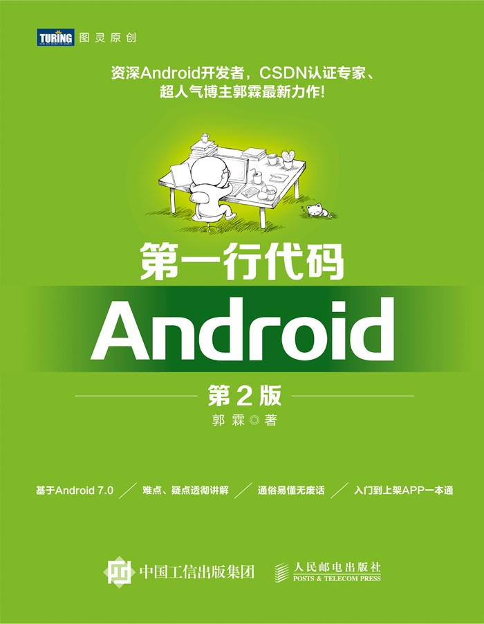
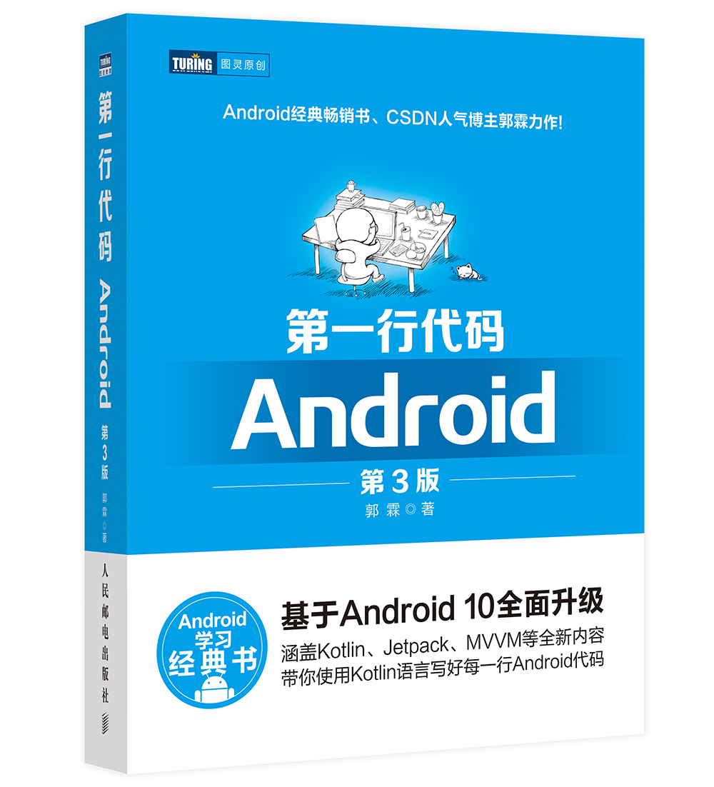

# 概述

> 本项目源于“上古”时期, 当时刚刚上大学, 刚刚接触计算机世界对一切是那么好奇. 刚好当时移动开发火热, 所以选择了开发一个 Android App 作为了自己课余项目.

本项目的所有代码都来自于 [郭霖](https://blog.csdn.net/guolin_blog)老师的书 《Andriod 第一行代码 (第二版)》

> 其实,第一版我也买了,也实现了书中的代码,可惜代码丢失, 当时也写的比较丑😅

**本项目仅做归档使用,本项目的代码已经不具有任何的参考价值**

请大家支持[郭霖](https://blog.csdn.net/guolin_blog)老师的新书:

# 总结

虽然现在已经不在从事 Android 相关的学习、工作,但是曾经这个不起眼、拿不出手的小项目,却给我以后的学习带来了很多益处.

通过写(抄)这个项目,我从0开始经历了一个产品(项目)的诞生,对UI、 数据库、网络、开源库、如何写代码等等等,有了自己的见解和收获,锻炼了我的自学能力, 也让我知道了英语在编程世界的重要性,可以说现在的一切都起源于这个自学 Android 的小项目.

希望自己不忘初心, 继续保持对技术的热情和好奇,不断学习, Keep learning!

